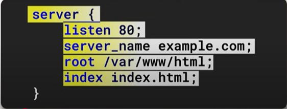
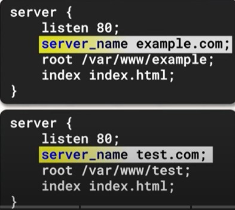

## Nginx project
### References
### System Requiremnets 
* 3x Virtual machine running Centos 
* 2 GB of RAM 
* 2 CPU cores 
---
### purpose 
 *  NGINX can save both static and dynamic content . it's a highly optimized for delivering static files like HTML , CSS and images very quickly .
 * it acts an intermediary between client requets and backend servers , offering features like caching , compression and security 
 * NGINX can distribute incoming requests across multiple  servers, balancing the load to improve availabilty and reliability and handling spikes efficiency . 
 **Nginx based on event driven and asynchronous** 
### Steps
* Install the EPEL repositort and NGINX package 
    ```powershell 
    dnf install epel-release -y
    
    ```
    ```powershell 
    dnf install nginx -y
    ```

* After instalation , you will manage NGINX using the systemd ervice manager 
    ```powershell 
    systemctl start nginx | systemctl enable nginx 
    
    ```
* Open firewall for http and https protocols 
     ```powershell 
     firewall-cmd --permanent --add-service=http |
     firewall-cmd --permanent --add-service=https
     ```
     ```powershell 
     firewall-cmd --reload 
     ```
* Security-Enhanced Linux (SELinux) provides and additional security layer 
     ```powershell 
     setsebool -P httpd_can_network_connect 1 | getsebool httpd_can_network_connect
     ```
---
### Configuration files 
**Main context** : Global setting like worker processes.
**Events context** : Handles connection processing.
**HTTP context**: Configures HTTP serer behavior.
**Server context**: Defines settings for virtual hosts (server blocks).
**Location context** : specifies how to process requests for specific locatios or URLs. 
**Main Context file** 


**Max_clients = worker_processes :heavy_multiplication_x: worker_connections**  

**Configuring Error and Access logging** 
Access logs 
``` powershell 
/var/log/nginx/access.log main; 
```
Error logs 
``` powershell 
/var/log/nginx/error.log warn; 
```
**Document Root and Permissions** : NGINX involves defining the document root , which is the directory where website files like **index.html** are stored 

**Dont forget to change the root** 
``` powershell 
sudo chown -R nginx:nginx /var/www/html
```
* make custom error page


* managing Virtual hosts **multiple of websites**
